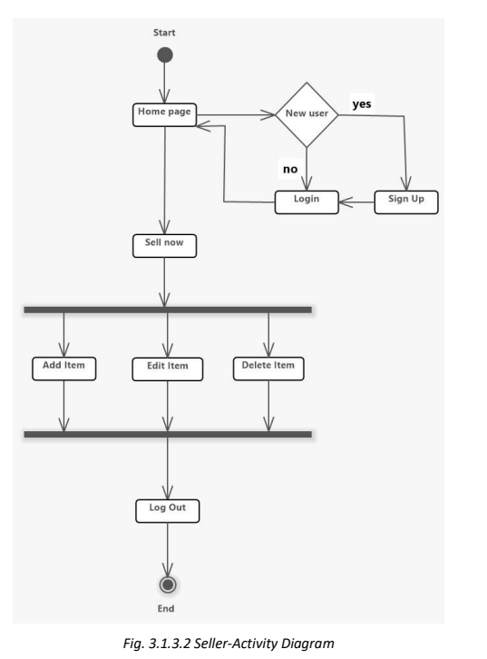

# About Second Chance👋

This project is to enable people to easily access, be made aware and utilize the various  ‘previously-owned’ everyday items and hostel necessities to get the best out of waste, at a fair price,  primarily focused on the student community, including hostels like that of MIT Manipal.

“Consume less, share better.”

  
  

## Inspiration for the Project:>👩‍💻
With the current problems of Global Warming, Contamination and Pollution, Fast Fashion and Textile Waste and their adverse effect on Health, it has never been more important to think about our individual and collective impact on the world we live in.

“We don’t have to sacrifice a strong economy for a healthy environment.” -Dennis Weaver

By making little changes to help reduce waste,  these small steps can turn into bigger steps encouraging others to make small changes too.
Taking inspiration from a Telegram Group already existing for this purpose in MIT Manipal, and expanding upon it, is our website ‘2 Chance’, where both sellers and buyers are students across streams; it consists of and portrays several goods(second-hand) for buyers to purchase at economical prices and thereby allows sellers to do away with their expendable items at reasonable prices in an environment-friendly way.

## Tech stack Used

  
  

## Modules 
Login/ Registration 
Easy Login/ Registration and Profile creation for the user. 
User Profile
Users can edit their profile, view, and manage their orders. They can also join in as a seller and start selling their products on the website.

## Demo

https://secondchance.onrender.com/

## Modules

- Login/ Registration
- Buy option for each product
- Payment gateway
- Customer Support 
- Dashboard for Admin
- Dashboard for Seller

## System design

Activity diagram 

Customer 

  
  

Seller 

  
  

## Sequence Diagram 
The Sequence Diagram for our project illustrates the interactions between the Buyer, Seller, and our Platform during a typical transaction.

  
  

  ## Schema Diagram 
The Schema Diagram for the project shows the structure of the database, which  consists of three collections: Users, Products, and Orders. 

The Customer Collection stores data such as name, email, and password for each registered user. The Product Collection stores details about each product, such as name, description, price, and image URL. 

The Order Collection stores data related to each transaction, such as the Buyer and Seller Ids, Product Ids, price, and timestamp. 

The Schema Diagram provides a visual representation of the data model used in the project, and helps developers understand how the data is organized and stored in the database.

  
  

## ScreenShort

  
   
     
      
       
        
         
      

  

